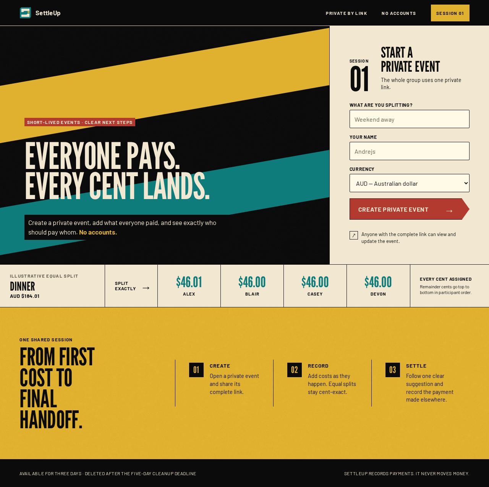
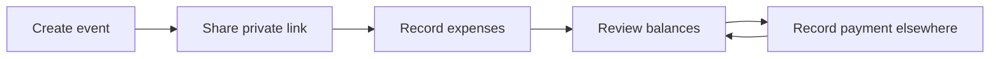

<p align="center">
  
</p>

<h1 align="center">SettleUp</h1>

<p align="center">
  No-login shared expenses for short-lived private-by-link events.
</p>

<p align="center">
  <a href="https://github.com/astrazds/settleup/actions/workflows/ci.yml"></a>
  <a href="LICENSE"></a>
</p>

SettleUp is a mobile-first shared-expense app for trips, weekends, meals, and
parties. One person starts a private event and shares the link. The group
records what everyone paid, sees exactly how each cost was split, and finishes
settling without creating accounts.

The promise is **“Everyone pays. Every cent lands.”** SettleUp records
payments made outside the app. It does not move money.

<p align="center">
  
</p>

## Why SettleUp?

Shared costs should not become a spreadsheet or a banking product. SettleUp
keeps one short-lived workspace behind a private link:

- No accounts. The complete event link is the access boundary, so keep it
  private. Anyone with the link can view and edit the event.
- Equal splits only, in integer minor units. Remainder cents are assigned
  deterministically and shown on the expense.
- One next settlement suggestion at a time, derived from the current ledger.
- Links work for three days. Event data is deleted at the five-day cleanup
  deadline.

## Install

SettleUp currently ships as source. Use Node.js 22.22.x, or Node.js 24 and
newer, with npm 12.

```sh
git clone https://github.com/astrazds/settleup.git
cd settleup
npm install
npm run dev:all
```

Open `http://127.0.0.1:5173`. The web development server proxies relative
`/api` requests and event streams to the API on port `8787`.

Run either surface separately with `npm run dev:web` or `npm run dev:api`.

## Use

1. Create a private event with a title, your name, and a currency, then share
   the link with the group.
2. Record equal-split expenses as they happen. Inspect the exact per-person
   shares, including remainder cents.
3. Open **Settle** for current balances and the next suggested payment. Record
   the payment after it happens outside SettleUp.
4. Use **People** to add or rename participants. A person referenced by an
   expense or payment cannot be removed.



Add and edit tasks are URL-addressable sheets. Live updates are invalidation
messages only; the browser refetches the server snapshot after a newer event
version.

## Privacy

SettleUp has no accounts, analytics, or advertising. The server does store
event titles, participant names, expenses, and recorded payments for the event
lifetime. Event tokens are stored as hashes. Anyone with the complete link can
read and change that data.

| Location | Purpose |
| --- | --- |
| SQLite event rows | Title, currency, participants, expenses, payments, until cleanup |
| Hashed event token | Resolve the private link without storing it in plaintext |
| Tab-session participant ID | Remember the current person in this browser tab |

See [PRIVACY.md](PRIVACY.md) for the complete data boundary.

## Limitations

- Splits are equal only. There are no percentages, weights, or itemized shares.
- SettleUp records payments. It does not transfer money or connect to a bank.
- Event links last three days. This is not a permanent ledger.
- The interface is English-only.
- The realtime broker is process-local, so v1 runs a single API replica.
- There is no hosted demo. Run it locally from this repository.

## Project structure

| Path | Purpose |
| --- | --- |
| `apps/web/` | Static React Router SPA and visual/product contracts |
| `src/server/` | Hono JSON API, SQLite, and SSE invalidation |
| `packages/contracts/` | Zod schemas and TypeScript types for the HTTP boundary |
| `docs/assets/readme/` | README icon and landing screenshot |

Product behavior lives in [`apps/web/PRODUCT.md`](apps/web/PRODUCT.md). The
visual system is [`apps/web/DESIGN.md`](apps/web/DESIGN.md). The API never
serves frontend assets or client routes.

## HTTP API

All event operations are scoped by the private event token.

| Method | Path | Request body |
| --- | --- | --- |
| `POST` | `/api/events` | `{ title, currency, firstParticipantName }` |
| `GET` | `/api/events/:token` | — |
| `GET` | `/api/events/:token/stream` | — |
| `POST` | `/api/events/:token/participants` | `{ name }` |
| `PATCH` | `/api/events/:token/participants/:participantId` | `{ name }` |
| `DELETE` | `/api/events/:token/participants/:participantId` | — |
| `POST` | `/api/events/:token/expenses` | `{ description, amountMinor, payerId, includedParticipantIds }` |
| `PATCH` | `/api/events/:token/expenses/:expenseId` | `{ description, amountMinor, payerId, includedParticipantIds }` |
| `DELETE` | `/api/events/:token/expenses/:expenseId` | — |
| `POST` | `/api/events/:token/payments` | `{ from, to, amountMinor }` |
| `PATCH` | `/api/events/:token/payments/:paymentId` | `{ from, to, amountMinor }` |
| `DELETE` | `/api/events/:token/payments/:paymentId` | — |

Event creation returns `201` with `{ token, snapshot }`. Other successful
mutations return `200` with the complete updated snapshot. Validation errors
return `{ error }` with `400`, missing resources `404`, stale
`If-Match` preconditions `412`, and expired links `410`.

Supported currencies are `AUD`, `USD`, `EUR`, `GBP`, and `NZD`. Money crosses
the API as integer minor units. Balances and settlement suggestions are
recomputed from the persisted ledger. The event stream sends `{ version }`
only; clients refetch the snapshot after a change.

## SQLite, retention, and deploy

The server uses `better-sqlite3` with foreign keys and WAL mode. Private links
work for three days; cleanup runs at startup and hourly, five days after
creation.

| Variable | Default | Purpose |
| --- | --- | --- |
| `PORT` | `8787` | HTTP listening port |
| `SETTLEUP_DB` | `data/settleup.sqlite` | SQLite path; `:memory:` is also supported |

`npm run build:all` produces `dist` for the API and `apps/web/build/client`
for the static host. Expose both through one public origin: route `/api/*` to
the API, and all other paths to the SPA `index.html`. Private JSON and event
streams must not be cached. The edge must allow long-lived, unbuffered SSE.

## Development

```sh
npm run dev:all      # API and web development servers
npm run lint         # Lint the frontend
npm run typecheck    # Type-check contracts, API, and frontend
npm test             # Contract, API, and frontend unit tests
npm run test:e2e     # Real-browser end-to-end tests
npm run build:all    # Build contracts, API, and SPA
```

CI on `main` is the [CI workflow](https://github.com/astrazds/settleup/actions/workflows/ci.yml).
It runs typecheck, unit tests, and `build:all`, then the Playwright suite
without pixel snapshots. Visual baselines stay a local Chromium gate. The
verification commands rebuild the generated contracts package. If they run
while `npm run dev:all` is active and a watcher reports a temporarily missing
contracts output, restart `npm run dev:all` after verification.

Contributions are welcome; read [CONTRIBUTING.md](CONTRIBUTING.md) before
opening a pull request. SettleUp is licensed under [MIT](LICENSE).
